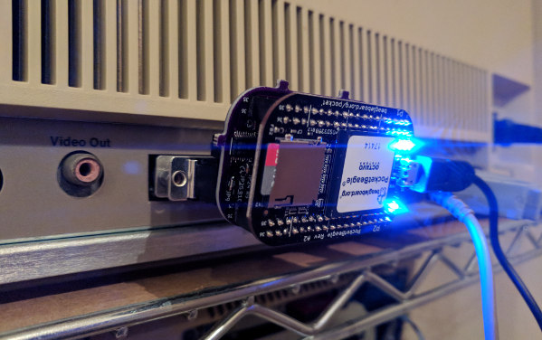
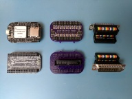
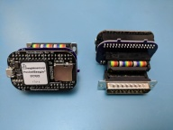
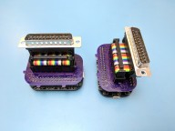
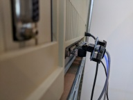
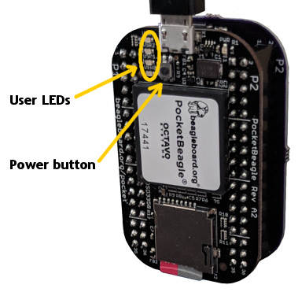
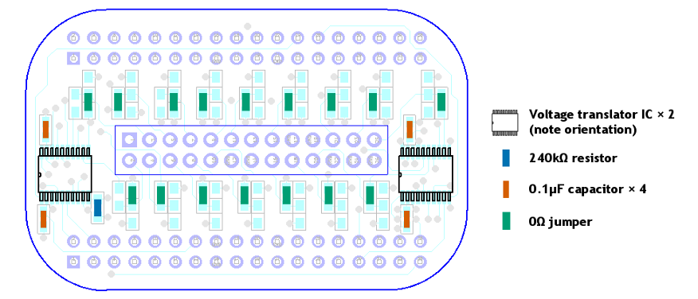

# Cameo/Aphid

is a small Apple parallel port hard drive emulator based on the
[PocketBeagle](http://beagleboard.org/pocket) single-board computer and the
[Cameo](../README.md) 3.3V ⇄ 5V level adapter cape. The hardware and software
described here aim to be a substitute for 5MB Apple
[ProFile](https://en.wikipedia.org/wiki/Apple_ProFile) external hard drives,
which were mainly used with Apple /// and Apple Lisa computers.

## Fair warning

Cameo/Aphid and associated hardware designs, software materials, and other
resources distributed alongside it are all made available for free with NO
WARRANTY OF ANY KIND. Any system that interfaces with Cameo/Aphid could suffer
malfunction, data loss, physical damage, or other harms. Some of these effects
could be permanent and/or unrepairable. If you're not prepared to risk these
consequences, don't use Cameo/Aphid.

**Additionally**: Cameo/Aphid is a new design that incorporates a number of
brand new, built-from-scratch software and hardware components. Although
considerable effort has been made to build a dependable emulator, Cameo/Aphid
still faces the test of time. It is possible, even likely, that some subtle
bugs have yet to be discovered and fixed.

## Gallery

Thumbnails link to high-resolution images, which may be helpful to people
assembling Cameo/Aphid. These images are not claimed to be illustrative of
good soldering technique.

[
Top and bottom views: PocketBeagle, Cameo, 5V I/O header to DB-25 adaptor.](
https://photos.app.goo.gl/s5zESxhNN7xtycam7)

[
Angled front and back views: Cameo/Aphid hardware components.](
https://photos.app.goo.gl/JWuywM5HkStonCPk9)

[
Angled side views: Cameo/Aphid hardware components.](
https://photos.app.goo.gl/5HDvheUgoSHjGmFy6)

[
Profile view: Cameo/Aphid hardware installed on an Apple Lisa computer.](
https://photos.app.goo.gl/Pqm4weZKrUjdkRwC8)

A few additional photos are available in a [Google Images gallery](
https://photos.app.goo.gl/dgnkZrpXCz5ze1h9A).

## Usage

Cameo/Aphid is designed to be used in much the same way as a real ProFile hard
drive: it must be on and ready before the computer can be used; once the
computer is off again, Cameo/Aphid can be shut down and turned off.

Because Cameo/Aphid is based on the PocketBeagle, a single-board computer that
must boot an operating system to function, Cameo/Aphid takes longer to become
ready than a dedicated hardware emulator
(e.g. [X/ProFile](http://sigmasevensystems.com/xprofile), [IDEfile](
http://john.ccac.rwth-aachen.de:8000/patrick/idefile.htm)) does.
**Additionally, like any modern computer (including the Apple Lisa),
Cameo/Aphid must undergo a shutdown process before power can be shut off.**
To accomplish this at any point after Cameo/Aphid is ready, press the [power
button](https://github.com/beagleboard/pocketbeagle/wiki/System-Reference-Manual#333_Powering_Down)
and wait for the "chasing lights" pattern (see below) to stop. It should only
take a few seconds.

Cameo/Aphid uses the four "user LEDs" on the PocketBeagle to provide a visual
indication of its state. The light patterns you are most likely to see are
these:

1. **Just after Cameo/Aphid turns on**: The LEDs turn on one-by-one until all
   four are on.
2. **While the operating system is booting**: One LED is on nearly constantly,
   another blinks in a "heartbeat" rhythm; a third blinks with SD card access.
3. **While Cameo/Aphid software is starting up**: All four LEDs blink
   sequentially in a rapid "chasing" or "rotating" pattern.
4. **When Cameo/Aphid is ready**: All four LEDs are on constantly.
5. **When Cameo/Aphid processes a disk command from the Apple**: All four LEDs
   blink off momentarily.
6. **During the shutdown process**: The chasing pattern resumes.
7. **When Cameo/Aphid is ready for power off**: The chasing pattern has frozen;
   at most one LED is on.

Finally, if Cameo/Aphid has encountered an unrecoverable error, the two central
user LEDs will slowly blink on and off. If this happens, try shutting down the
device by pressing the power button. Once the blinking stops, or if the power
button appears to have no effect after some time, try removing power from
Cameo/Aphid and then restoring it.

### Physical connections

Cameo/Aphid receives power from an ordinary Micro-B USB cable. Power
consumption data is hard to find for the PocketBeagle, but just about any USB
power source that can charge a phone reasonably well will probably work. A
computer with a USB-A port can supply power as well; don't be surprised by the
PocketBeagle's operating system making the PocketBeagle appear to be both a
network adapter and a storage device.

Most installations will connect Cameo/Aphid to the Apple via a short adapter
cable like the one described in the [main Cameo README.md](
../README.md#assembly). In this configuration, Cameo/Aphid dangles from the
Apple's DB-25 socket with no enclosure or physical support. If your Apple is
installed on an unpainted metal table or rack, take care that no components or
solder joints on the PocketBeagle or Cameo circuit boards rest on any metal
surface: stray electrical connections could result.

### Hard drive images

Cameo/Aphid stores data from the simulated hard drive in an ordinary file on
the PocketBeagle's MicroSD card. This file has no metadata and a very simple
format: just as a ProFile stores 5,175,296 bytes of data, the hard drive image
file is a 5,175,296-byte file; and just as a ProFile block is 532 bytes, each
contiguous 532-byte chunk of the image file holds data from one of the
simulated drive's blocks. These blocks are arranged sequentially in the file,
starting from block $0000 and counting up to block $25FF.

(Aside: neither Cameo/Aphid nor the Apple parallel hard disk protocol itself
distinguish between "tag bytes" or "data bytes", even though these divisions of
a block are important to Lisas.)

The operation system that runs on Cameo/Aphid's PocketBeagle computer is a
version of Debian Linux. In standard Cameo/Aphid setups, the hard drive image
file is `/usr/local/lib/cameo-aphid/profile.image`. To gain access to this
file, for instance to make a backup or to replace it with a different disk
image file, you use the same utilities (typically SSH, SCP) that you use for
command line access and file transfer with ordinary Linux systems. It's
necessary to establish a network connection with the PocketBeagle before you
can use these tools; often this simply involves plugging the PocketBeagle into
a conventional computer's USB port. (For more guidance on connecting to your
PocketBeagle, see the [BeagleBone "Getting Started" guide](
http://beagleboard.org/static/beaglebone/latest/README.htm).)

In the future, it may become possible to upload and download disk images via a
web browser.

:warning: **Be sure not to change or replace the hard drive image file while
the Apple is actively reading from or writing to the simulated disk drive.
After altering the image file, you must shut down and restart Cameo/Aphid
before the Apple attempts to access the drive.**

## Making your own

At present, the only way to get your own Cameo/Aphid is to build one. Finished
assemblies are not known to be available anywhere, but since all the
Cameo/Aphid-specific software and hardware designs are released into the public
domain, anyone is free to build and sell them without seeking anyone's
permission or negotiating any license terms. The parts cost for a complete,
ready-to-use Cameo/Aphid setup is around $55 for a home hobbyist; manufacture
in limited quantities might lower this figure somewhat.

Building Cameo/Aphid "from scratch" requires some proficiency in the following
skills:

* Soldering surface-mounted components, including ICs in small (TSSOP) packages
  with a somewhat narrow (0.65mm) pin pitch.
* ~~"Linux stuff": SSH, using the command line, `sudo`, editing configuration
  files, that sort of thing.~~

If you think you *might* be able to do it, you probably can, with patience.

### Hardware assembly

Cameo/Aphid uses the Texas Instruments [TXS0108E](
http://www.ti.com/product/TXS0108E) series of level translator ICs. A complete
parts list for assembling Cameo/Aphid appears in the [main Cameo README.md](
../README.md#costs). Nearly all installations will want to use the short
adapter cable described there so that Cameo/Aphid can dangle from a parallel
port on the Apple.

This diagram shows the locations and values of all of the SMD components that
should be installed on the Cameo PCB to support Aphid:

The jumpers on the "plugboard" pads establish a direct connection between the
5V I/O header pins and the level translator chip. There are no terminating
resistors (or any other kind of termination) installed, so the connection to
the Apple should be short. Take care to replicate the positioning of all
components exactly---the plugboard pads are tightly spaced, and it's especially
easy to put a jumper in the wrong place.

The [main Cameo README.md](../README.md#assembly) has more detailed assembly
information.

When building a DB-25 port adapter to connect Cameo to the Apple: sometimes the
Apple's parallel port will have plastic material or a metal shim blocking pin
7, which is unused. If this is the case for your system, remove pin 7 (the
centre pin in the top, wider row of pins) from the adapter's DB-25 plug with a
pair of pliers. Some force may be required.

### Software installation

The easiest way to install Cameo/Aphid software on a MicroSD card is to "flash"
a pre-built software image onto the card: it requires no skill with "Linux
stuff". Download a software image (made with the instructions below) from [this
link]( https://drive.google.com/open?id=1JVaIsEFMeORKmzB1lwtAaCIO8UU0FEhH)
(note: a 431 MB file), then follow [these instructions](
https://beagleboard.org/getting-started#update) on using Etcher to install the
image onto a good quality MicroSD card (4GB or more, preferably [Class
10/U1/V10](https://en.wikipedia.org/wiki/Secure_Digital#Speed_class_rating) or
better). Once flashed, the card can be plugged into the PocketBeagle, and
Cameo/Aphid will be ready for [use](#usage), appearing to the Apple as an empty
(uninitialised) ProFile. The following instructions can then be ignored.

#### Full instructions for manual software installation

The Cameo/Aphid software comprises

* firmware programs for each of the PocketBeagle's two PRU-ICSS real time
  I/O coprocessors ("PRUs" for short)
* a [Python program](profile.py) that runs on the PocketBeagle's main
  processor, interpreting sector read/write commands from the Apple and
  applying them to a hard drive image file.

The software targets the `Debian 9.4 2018-06-17 4GB SD IoT` and `Debian 9.3
2018-03-05 4GB SD IoT` BeagleBoard.org Debian Linux disk images, available
[here](http://beagleboard.org/latest-images). If not listed under "Recommended
Debian images", look for these images under "Older Debian images" further down
on the page. Newer images may work but have not been tested.

Follow these steps to set up the Cameo/Aphid software on your PocketBeagle:

#### 1. Install the Linux disk image onto a new MicroSD card.

Download one of the Debian Linux disk images specified above from the
BeagleBoard.org [Latest Firmware Images](http://beagleboard.org/latest-images)
page (preferably the Debian 9.4 image). Follow the [instructions](
https://beagleboard.org/getting-started#update) to install it on a good quality
MicroSD card. (The PocketBeagle used to develop the Cameo/Aphid software had a
card with a Class 10 [speed class rating](
https://en.wikipedia.org/wiki/Secure_Digital#Speed_class_rating).)

#### 2. Enable remoteproc/RPMsg for controlling the PocketBeagle's PRUs (Debian 9.3 only).

:warning: **NOTE: This step is not required for the `Debian 9.4 2018-06-17 4GB
SD IoT` Debian Linux disk image.**

Boot your PocketBeagle and connect to it via SSH. As above, this usually
entails plugging the PocketBeagle into your computer's USB port and logging in
to `beaglebone.local` as user `debian` with password `temppwd`. For more
guidance on connecting to your PocketBeagle, see the [BeagleBone "Getting
Started" guide](http://beagleboard.org/static/beaglebone/latest/README.htm).

Once in, edit the file `/boot/uEnv.txt` with superuser privileges. Find the
line containing this text:

    #uboot_overlay_pru=/lib/firmware/AM335X-PRU-UIO-00A0.dtbo

and just beneath it, add a new line with the following text:

    uboot_overlay_pru=/lib/firmware/AM335X-PRU-RPROC-4-9-TI-00A0.dtbo

Take care to avoid typos or copy/paste errors: mistakes in `/boot/uEnv.txt` can
leave your MicroSD card unbootable, and you'd need to start over from step 1.

#### 3. Compile the firmware and prepare an empty 5MB disk image.

Copy this directory and all of its contents to the PocketBeagle (usually
accomplished via SCP to `beaglebone.local`). It's fine to place the copy
anywhere in the home directory of the `debian` user.

Log back into your PocketBeagle and cd into the copy of this directory. Begin
the compile by typing `make`. Compilation of the firmware and construction of
the disk image (which is just an empty 5,175,296-byte file called
`profile.image`) takes a couple dozen seconds.

#### 4. Install the Aphid software, firmware, disk image, and service script.

From the same directory, execute the command `make install` with superuser
privileges. This command creates a permanent installation directory for the
Cameo/Aphid software and disk image, then installs a file that tells the
PocketBeagle to configure and start the entire Cameo/Aphid emulator system on
boot. The specific steps that `make install` performs are:

- Copy the PRU-ICSS firmware files `aphd_pru0_datapump.fw` and
  `aphd_pru1_control.fw` to the `/lib/firmware` directory.
- Create the directory `/usr/local/lib/cameo-aphid` and copy the disk image
  file `profile.image` and the Python program `profile.py` inside.
- Copy the `cameo-aphid.service` service script to 
  `/lib/systemd/system`.

#### 5. Tell the PocketBeagle to start the Cameo/Aphid emulator system on boot.

With superuser privileges, execute the command `systemctl enable cameo-aphid`.

Software installation is complete after this step. The next time the
PocketBeagle boots, the Cameo/Aphid emulator should be ready to emulate a 5 MB
Apple ProFile hard drive. See the [Usage](#usage) section of this file for
usage instructions.

## Technical overview

The information in this section is not necessary to build or use Cameo, but may
be of interest to people interested in making modifications or investigating
similar applications.

Cameo/Aphid takes advantage of the PocketBeagle's [PRU-ICSS coprocessors](
http://processors.wiki.ti.com/index.php/PRU-ICSS) ("PRUs" for short) to achieve
a dependable implementation of the Apple parallel port hard drive protocol.
Like the I/O subsystems on modern PCs or the [channel controllers](
https://en.wikipedia.org/wiki/Channel_I/O) on mainframes of yore, the PRUs
units handle the timing-sensitive low-level details of the protocol so that the
main processor can handle its various custodial tasks on its own schedule.

The PocketBeagle's [AM3358 SoC](http://www.ti.com/product/AM3358) includes two
PRUs. Each PRU has a different pattern of direct connectivity to the pins of
the PocketBeagle's two expansion headers. PRU 0 can access eight pins in either
the input or output direction plus four more as inputs only and two more as
outputs only; PRU 1 can access six pins in either the input or output direction
plus two more as inputs only. Cameo's pair of level translator ICs can
accommodate only 16 signal lines altogether, so of these 22 pins, Cameo passes
through all 14 two-way signals, one PRU 0 input-only line, and one PRU 0
output-only line.

Inspired by this arrangement and the nature of the Apple parallel port hard
drive protocol, the overall Cameo/Aphid design allocates PRU 0 to handle
clocked data transfer and calculation of the (odd) parity signal for the
parallel port's eight bidirectional I/O lines, and it allocates PRU 1 to handle
the parallel port's three other control lines. Notionally, PRU 1 supervises the
handling of all transactions with the Apple; PRU 0 is the "data pump" that
streams bytes to and from the Apple on PRU 1's request, while the Python
program running on the PocketBeagle's main ARM processor loads and saves block
data in the disk image file whenever PRU 1 instructs it to do so.

Although PRU 0 can directly access eight of the I/O pins as either inputs or
outputs, a PRU cannot select or change which of these "direct access" modes is
in effect. Unfortunately, that means that these modes aren't suitable for
bidirectional I/O, even though Cameo is otherwise well-organised to facilitate
this: PRU 0 simply can't alternate between sending and receiving data via
direct access. So, to manage the eight data lines, PRU 0 falls back to using
the AM3358's GPIO registers---a method available to either PRU. Still, the
division of labour between both PRUs is convenient: it allows PRU 0 to respond
quickly to the Apple's \PSTRB clocking signal and to compute the correct value
for \PPARITY (both accessed by PRU 0 directly) whilst PRU 1 and the ARM are
busy doing other things.

PRU 0 and PRU 1 do most of their information sharing through the PRU shared
memory region, with data transfer requests and completions signaled via
interrupts. Communication between PRU 1 and the ARM uses Linux's [RPMsg](
https://www.kernel.org/doc/Documentation/rpmsg.txt) I/O framework, and because
RPMsg messages can be no larger than 512 bytes, multiple messages are necessary
to transfer block data between the ARM and the PRUs.

All three major Cameo/Aphid software/firmware components are extensively
commented, so further detail here may be redundant. Good starting places for
reading Cameo/Aphid source code are:

* [profile.py](profile.py): the entire Python program that runs on the ARM.
* [aphd_pru0_datapump.asm](firmware/aphd_pru0_datapump/aphd_pru0_datapump.asm):
  the entire source code for the PRU 0 "data pump" firmware.
* [aphd_pru1_control.cc](firmware/aphd_pru1_control/aphd_pru1_control.cc): core
  of the PRU 1 "control" firmware.

## Future work

Potential future improvements and new features for Cameo/Aphid include:

* 10MB ProFile emulation (easy), or Widget emulation (harder, since many more
  low-level hard drive commands are required).

* Support for Lisa 2/10 drive bay installation: while 5V power is available
  from the same cable that powered the original Widget hard drive, since the
  drive bay is not accessible while the Lisa is on, it will be necessary to
  have some way of powering down the PocketBeagle cleanly before the Lisa
  shuts off hard drive power on shutdown. Additionally, the longer ribbon cable
  for connecting the Widget to the I/O board may require terminating resistors
  or other components to be installed on Cameo. Finally, some substitute for
  the green hard drive status LED should be devised.

* A web browser interface for hard drive image file management: by plugging
  Cameo/Aphid into a modern computer and visiting a designated web address, the
  user can upload and download hard drive image files to an image library, as
  well as select an "active" image that Cameo/Aphid serves to the Apple.
  (Even a relatively small MicroSD card could easily store several thousand
  hard drive image files.)

* A "magic blocks" mechanism: if the Apple attempts to read or write to a
  block outside of the valid range of block addresses, the `profile.py` program
  running on the ARM will dispatch the request to a configurable external
  handler. This handler can service the read or write request as it chooses.
  For example, the Apple might write `http://en.wikipedia.org` to (invalid)
  block address $123456, and then reads from this block and the blocks
  immediately following would "magically" contain the text of English
  Wikipedia's front page. (The Apple would require modified disk drivers to
  take advantage of this functionality.)

* A "hard drive image file selector" disk image: a special disk image that
  boots into a program that communicates with Cameo/Aphid using the "magic
  block" mechanism (above) and allows the user to choose a particular hard
  drive image file from a menu.

* An Aphid-specific level translator PCB design instead of configurable,
  multi-purpose Cameo and its plugboard: it may be possible for the PCB to be
  a two-layer design, offering significant cost advantages. An integral DB-25
  plug connector could be an additional feature.

## Other notes

To the fullest extent possible, Cameo/Aphid is released into the public domain.
Nobody owns Cameo/Aphid.

The modified linker command files for the
[PRU 0](firmware/aphd_pru0_datapump/AM335x_PRU.cmd) and
[PRU 1 firmware](firmware/aphd_pru1_control/AM335x_PRU.cmd) bear copyright
statements by Texas Instruments and are mostly generated automatically by TI's
[Code Composer Studio](http://www.ti.com/tool/CCSTUDIO) IDE.

All other source code files associated with Aphid are forfeited into the public
domain with no warranty. For details, see the [LICENSE](../LICENSE) file.

Apple, ProFile, and Lisa are [Apple Inc.](https://www.apple.com/) trademarks.
PocketBeagle, BeagleBone, and BeagleBone.org are [BeagleBone.org](
http://beaglebone.org) trademarks. Sitara and Code Composer Studio are
[Texas Instruments Inc.](http://www.ti.com) trademarks.

## Acknowledgements

It would not have been possible for me to create Cameo/Aphid without the help
of the following people and resources:

* [Dr. Patrick Schäfer](http://john.ccac.rwth-aachen.de:8000/patrick/index.htm),
  whose [IDEfile](http://john.ccac.rwth-aachen.de:8000/patrick/idefile.htm) and
  [UsbWidEx](http://john.ccac.rwth-aachen.de:8000/patrick/UsbWidEx.htm) project
  pages were invaluable to the project (as were actual UsbWidEx and IDEfile
  devices of my own).
* [bitsavers.org](http://bitsavers.org)'s archived technical documentation.
* The [Sitara Processors Forum](https://e2e.ti.com/support/arm/sitara_arm) on
  the [TI E2E Community](https://e2e.ti.com/).
* Blog posts and other materials by
  [Dr. Andrew Wright](http://theduchy.ualr.edu/), Jason Kridner,
  [Dr. Mark A. Yoder](https://elinux.org/BeagleBoard_Education_Workshops),
  [Ken Shirriff](http://www.righto.com), and others.
* Encyclopedic references like the
  [AM335x Technical Reference Manual](http://www.ti.com/lit/pdf/spruh73), the
  [PRU Assembly Instruction User Guide](http://www.ti.com/lit/pdf/spruij2), the
  [AM335x PRU-ICSS Reference Guide](
  https://elinux.org/images/d/da/Am335xPruReferenceGuide.pdf), the
  [PRU Assembly Language Tools User's Guide](
  http://www.ti.com/litv/pdf/spruhv6b), the
  [PRU Optimizing C/C++ Compiler v2.2 User's Guide](
  http://www.ti.com/litv/pdf/spruhv7b), and the
  [PocketBeagle System Reference Manual](
  https://github.com/beagleboard/pocketbeagle/wiki/System-Reference-Manual).
* The entire [LisaList](https://groups.google.com/forum/#!forum/lisalist)
  community.
* Anonymous friends.

-- [_Tom Stepleton_](mailto:stepleton@gmail.com), 11 August 2017, London
