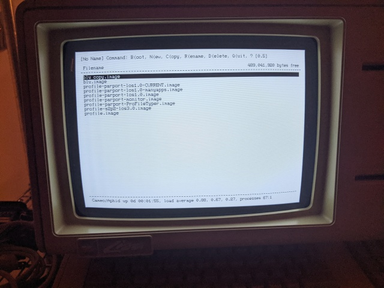

# Cameo/Aphid Selector

The Cameo/Aphid drive image selector program ("the Selector" for short) is a
program for Apple Lisa computers that controls a [Cameo/Aphid ProFile hard
drive emulator](https://github.com/stepleton/cameo/tree/master/aphid). Most
Selector users will use the Selector to create, manange, and boot hard drive
images that belong to a catalogue of hard drive images on their Cameo/Aphid
devices.

## Installation

This README file is a placeholder; before long, additional information and
installation instructions will be provided here. For now, if you have a
Cameo/Aphid running the most current version of the Cameo/Aphid software
listed [in the Cameo/Aphid README](../README.md#software-installation), you
may do the following:

1. Back up your Cameo/Aphid microSD card.

2. On a modern computer, copy these files into the microSD card's FAT
   partition (called `CAMEO_APHID`): `profile.py`,
   `profile_plugin_FFFEFC_selector_rescue.py`,
   `profile_plugin_FFFEFD_system_info.py`,
   `profile_plugin_FFFEFE_filesystem_ops.py`,
   `profile_plugin_FFFEFF_key_value_store.py`, and `profile_plugins.py`. Note
   that you will overwrite the existing `profile.py`.

3. Rename any existing file on the FAT partition called `profile.image` to
   something else.

4. Download `selector.image.zip`, unpack `selector.image` and copy it to the
   microSD card's FAT partition, and rename it `profile.image`.

## Manual and more

There is a detailed [user's manual](MANUAL.md) and a document that describes
[the protocol the Selector uses](PROTOCOL.md) to control the Cameo/Aphid.

-- _[Tom Stepleton](mailto:stepleton@gmail.com), 17 January 2021, London_
